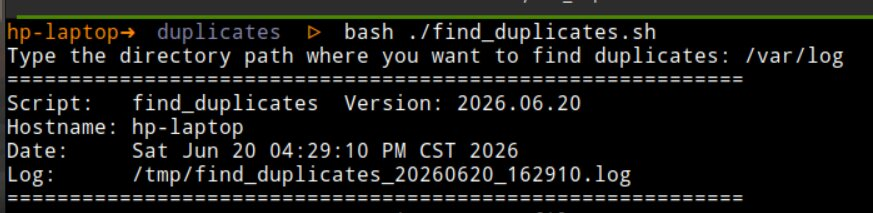
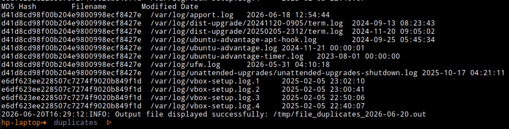

# Find duplicates

This BASH script lists duplicated files in a specific directory. It works in Linux-based systems only.

The main features are listed as follows:
- Find duplicate files using MD% checksum logic.
- Display the `hash`, absolute `filename`, and last `modification date`.
- Sends the output to the `/tmp` directory:
    - The `/tmp/file_duplicates_YYYY-MM-DD.out` file contains the list of duplicates.
    - The `/tmp/file_duplicates_YYYY-MM-DD.log` with the log of the script execution.


## Usage

- Using the path as an argument.

```bash
bash ./find_duplicates.sh -d /var/log
# or
bash ./find_duplicates.sh --directory /var/log
```

- If not argument provided, the script asks for the path interactively

i.e.

```bash
bash ./find_duplicates.sh
```

- Prompt example:



## Output

The output `/tmp/file_duplicates_YYYY-MM-DD.out` file is stored as plain text.

It contains the list of duplicates organized in three columns:
- MD5 Hash.
- The absolute filename.
- The last modification date.

i.e.




## Conclusion

This script identifies file duplicates. Whoever uses it may decide how to handle those.

